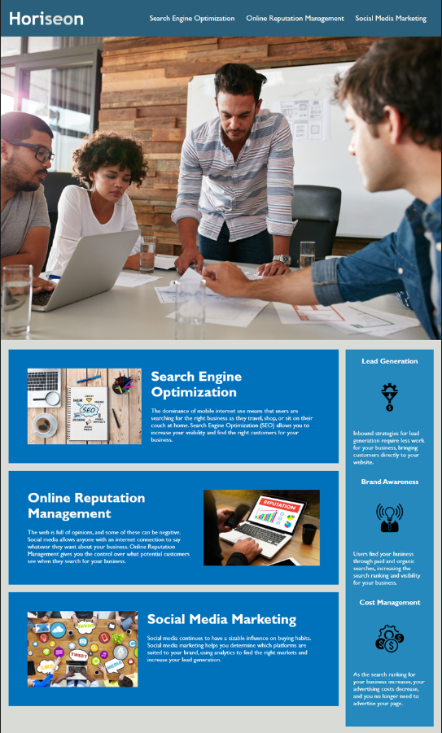

# <Week-1-Challenge>

## Description

Provide a short description explaining the what, why, and how of your project. Use the following questions as a guide:

-To create better accesibility and code legacy.
-Testing reading other people's code and editing
-It increased the user accessibility as well as code legibility
-I learned how to link to a different part of the same page using id and class element attributes

## Usage

-links in nav bar navigate to different section further down the page

## Credits

UofO EdX Bootcamp coursework.

## License
